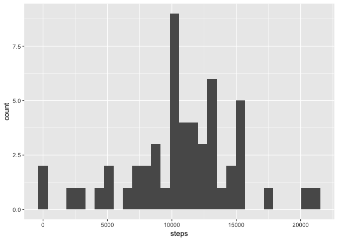
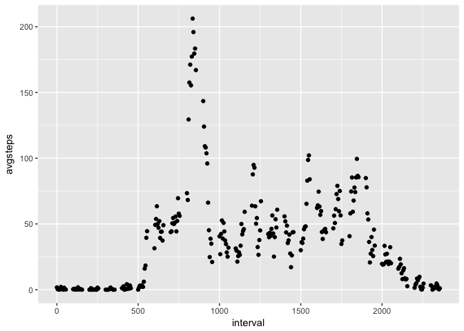
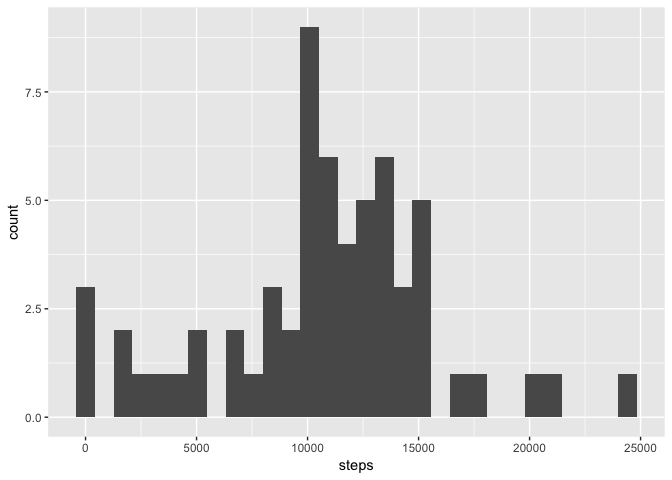
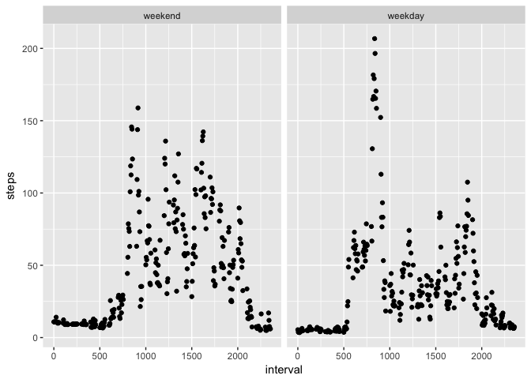

# Reproducible Research Project one


## Reading in the data

First you have to read in the data


```r
activity <- read.csv('activity.csv')
```

## Grouping, summarizing and producing a histogram

You then group by dates, summarize on the sum function of steps, rename the columns and produce a histogram


```r
## Histogram
activity <- group_by(activity, date)
act_sum <- summarize(activity, sum(steps))
colnames(act_sum)[2] <- 'steps'
suppressWarnings(ggplot(act_sum, aes(steps), na.rm=TRUE) + geom_histogram())
```

```
## `stat_bin()` using `bins = 30`. Pick better value with `binwidth`.
```

```
## Warning: Removed 8 rows containing non-finite values (stat_bin).
```

<!-- -->

```r
## Mean steps per day
datadays <- nrow(na.omit(act_sum))
act_mean <- sum(na.omit(activity$steps))
meansteps <- act_mean / datadays

## Median steps per day
mediansteps <- median(na.omit(act_sum$steps))

paste("Mean steps:", meansteps, "")
```

```
## [1] "Mean steps: 10766.1886792453 "
```

```r
paste("Median steps:", mediansteps, "")
```

```
## [1] "Median steps: 10765 "
```

## Time series

Next we make a time series plotting the interval against the average steps for that interval accross all days


```r
interval <- group_by(activity, interval)
time_series <- summarize(na.omit(interval), mean(steps))
colnames(time_series)[2] <- 'avgsteps'
qplot(interval, avgsteps, data = time_series)
```

<!-- -->

```r
ordered <- time_series[order(-time_series$avgsteps),]
ordered[1,]
```

```
## # A tibble: 1 × 2
##   interval avgsteps
##      <int>    <dbl>
## 1      835 206.1698
```

## Missing values

Next ya gotta put in something for the missing values.  I chose an avg of steps across all days to put in for the missing step values.  


```r
## Calculate number of missing values
activity <- as.data.frame(activity)
activity <- cbind(seq.int(nrow(activity)), activity)
colnames(activity)[1] <- 'index'
NAindex <- activity$steps %in% NA
NAs <- sum(activity$steps %in% NA)

paste("Number of missing values:", NAs, "")
```

```
## [1] "Number of missing values: 2304 "
```

```r
## Merge to get avg steps per interval for missing values
new_activity <- activity
merged <- merge(activity[activity$steps %in% NA,], time_series, by.x = 'interval', by.y = 'interval')
new_activity[NAindex,"steps"] <- merged[,'avgsteps']

## Histogram
new_activity <- group_by(new_activity, date)
new_act_sum <- summarize(new_activity, sum(steps))
colnames(new_act_sum)[2] <- 'steps'
ggplot(new_act_sum, aes(steps)) + geom_histogram()
```

```
## `stat_bin()` using `bins = 30`. Pick better value with `binwidth`.
```

<!-- -->

```r
## Mean steps per day
meansteps <- sum(new_activity$steps) / nrow(new_act_sum)

## Median steps per day
mediansteps <- median(new_act_sum$steps)

paste("Mean steps:", meansteps, "")
```

```
## [1] "Mean steps: 10766.1886792453 "
```

```r
paste("Median steps:", mediansteps, "")
```

```
## [1] "Median steps: 11015 "
```


## Weekend analysis

Create a new factor variable in the dataset with two levels -- "weekday" and "weekend" indicating whether a given date is a weekday or weekend day.

Make a panel plot containing a time series plot (i.e. type = "l") of the 5-minute interval (x-axis) and the average number of steps taken, averaged across all weekday days or weekend days (y-axis). The plot should look something like the following, which was created using simulated data:


```r
new_activity$date <- as.character(new_activity$date)
new_activity$date <- as.Date(new_activity$date)
#create a vector of weekdays
weekdays1 <- c('Monday', 'Tuesday', 'Wednesday', 'Thursday', 'Friday')
new_activity$wDay <- factor((weekdays(new_activity$date) %in% weekdays1), 
         levels=c(FALSE, TRUE), labels=c('weekend', 'weekday')) 

weekeys <- group_by(new_activity, interval, wDay)
weekeys <- summarize(weekeys, mean(na.omit(steps)))
colnames(weekeys)[3] <- 'steps'
ggplot(weekeys, aes(interval, steps)) + geom_point() + facet_wrap(~wDay, nrow = 1)
```

<!-- -->
